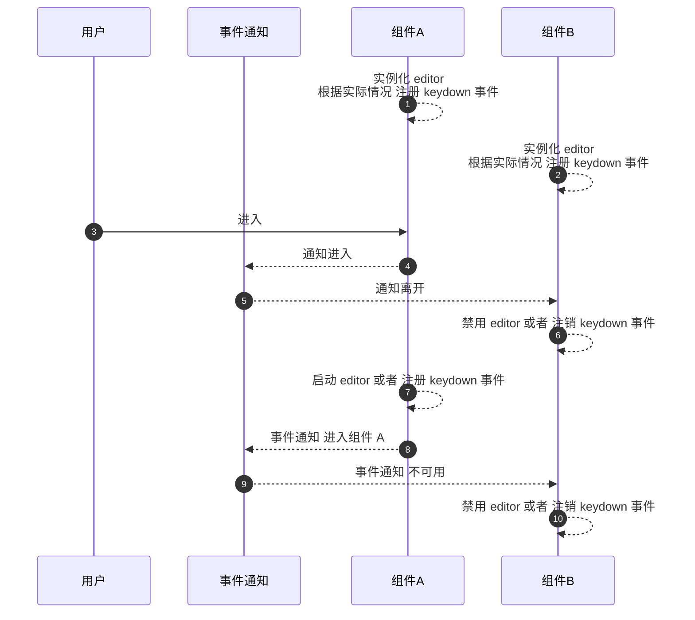
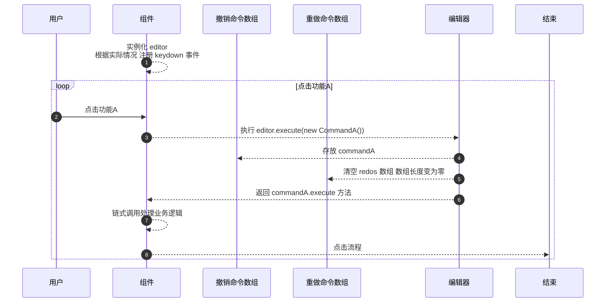
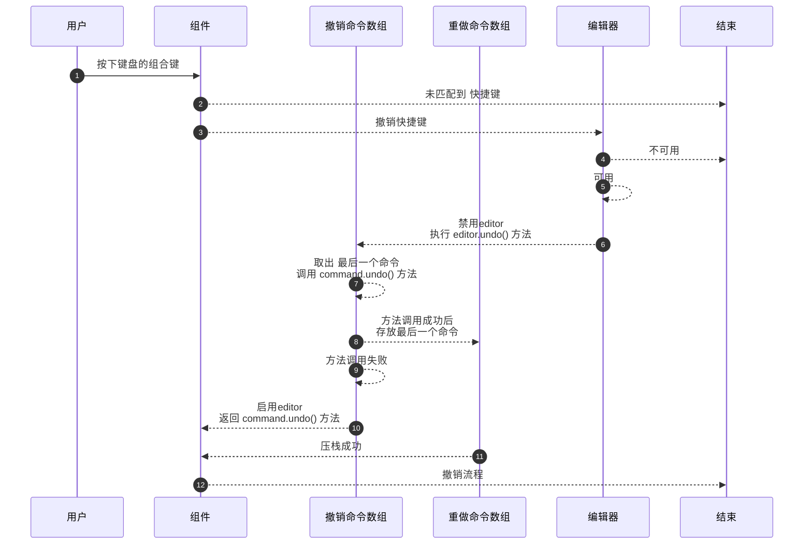
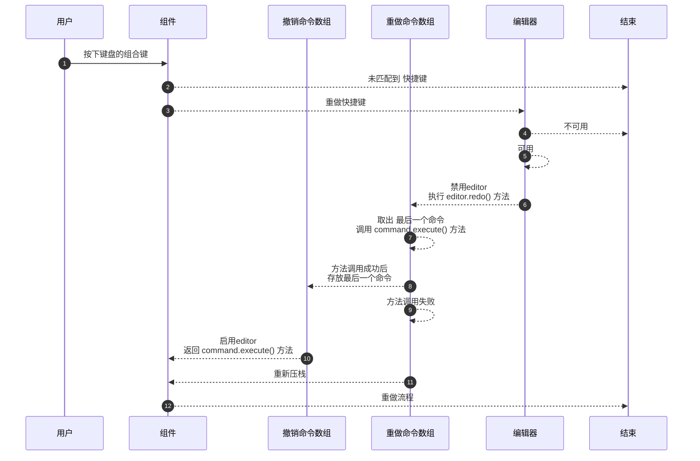

## 撤销重做模块

> 阅读 mermaid 流程图需要安装 [markdown-preview-enhanced](https://marketplace.visualstudio.com/items?itemName=shd101wyy.markdown-preview-enhanced) 插件

> 从零开始做一个撤销重做模块教程，见 [tutorial](tutorial.md) 教程

### 撤销重做模块功能

- [x] 多实例
- [ ] 持久化
- [ ] 命令运行队列
- [ ] 指定撤销重做步骤数
- [ ] 撤销重做列表的大小控制

#### 事件通知流程图

> 实线：用户主动触发事件 虚线：撤销重新模块的事件响应



#### 执行流程图

> 实线：用户主动触发 虚线：程序触发

模块说明 撤销命令数组: 存放用户触发的功能

重做命令数组: 存放用户重做的功能（当用户主动出发功能会清空重做命令数组）

从三个阶段说明

阶段 1：A 修改成 B

阶段 2：B 撤销成 A

阶段 3：A 重做成 B

##### 阶段 1：A 修改成 B



##### 阶段 2：B 撤销成 A



##### 阶段 3：A 重做成 B



#### 实例化 Editor

```javascript
import { Editor } from "./mod.ts";
import { RejectCommand } from "./tests/reject-command.ts";
import { ResolveCommand } from "./tests/resolve-command.ts";

/** 是否是苹果系统，用于判断不同平台的快捷键 */
const IS_MAC = navigator.platform.toUpperCase().indexOf("MAC") >= 0;

/** 快捷键配置 */
const config = {
  "settings/shortcuts/undo": "KeyZ",
  "settings/shortcuts/undo2": "KeyY",
};

/** 实例化 */
const editor = new Editor();

/** 执行 RejectCommand 命令 */
editor.execute(new RejectCommand()); // 示例代码
/** 执行 ResolveCommand 命令 */
editor.execute(new ResolveCommand()); // 示例代码

// 根据实际情况 注册 keydown 事件
window.document.addEventListener("keydown", (event) => {
  const { ctrlKey, shiftKey, metaKey, code } = event;
  switch (code) {
    case config["settings/shortcuts/undo"]:
      if (IS_MAC ? metaKey : ctrlKey) {
        // 注意：阻止默认事件不能放在外面，会阻止浏览器或者input/textarea的默认事件，应该放在相应的按键组合中去阻止
        event.preventDefault();
        if (shiftKey) {
          console.log("ctrl + shift + z 恢复撤销");
          editor.redo();
        } else {
          console.log("ctrl + z 撤销");
          editor.undo();
        }
      }
      break;
    case config["settings/shortcuts/undo2"]:
      if (IS_MAC ? metaKey : ctrlKey) {
        event.preventDefault();
        console.log("ctrl + Y 恢复撤销");
        editor.redo();
      }
      break;
    default:
      break;
  }
  return false;
});

export { editor };
```

#### 禁用编辑器

```javascript
editor.disabled = true;
```

#### 启动编辑器

```javascript
editor.disabled = false;
```

#### 撤销命令数组

```javascript
editor.undos;
```

#### 重做命令数组

```javascript
editor.redos;
```
